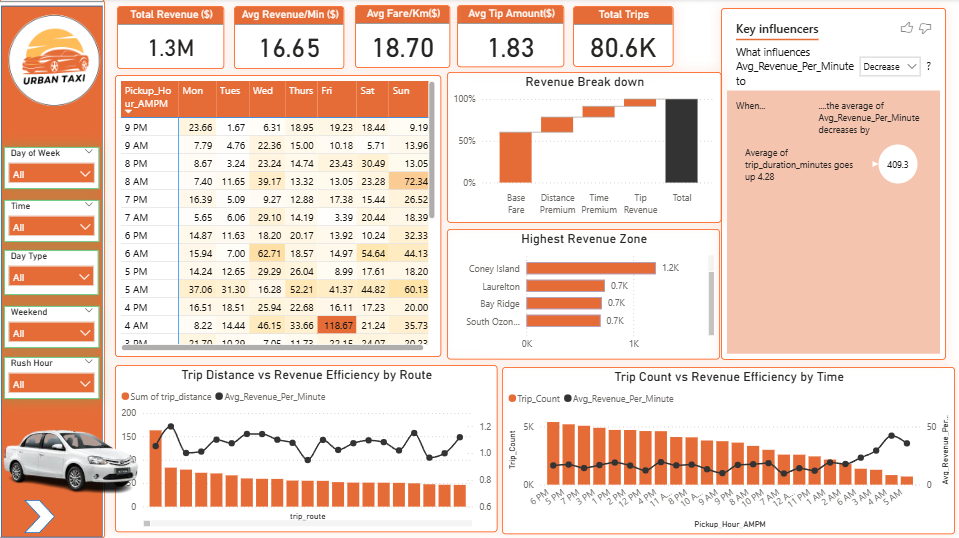
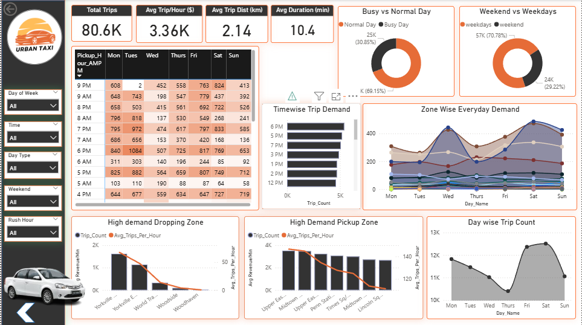

# 🚕 Urban Cab Revenue Optimization & Demand Forecasting

This project focuses on building a data-driven system to **predict hourly zone-wise cab demand** and provide **revenue optimization insights** for urban mobility operators. It combines advanced **Exploratory Data Analysis (EDA)**, **statistical testing**, **machine learning modeling**, and **interactive Power BI dashboards** to enable strategic decision-making.

---

## 📊 Project Highlights

### 1. **EDA with DuckDB**
- Leveraged **DuckDB** for scalable, SQL-style in-memory analysis.
- Extracted key features: `hour`, `day_of_week`, `trip_duration`, `fare_per_km`, `tip_percent`, `rush_hour`, etc.
- Zone-wise aggregations and visual patterns of demand, fare, and trip profitability.

### 2. **Statistical Analysis**
- Performed hypothesis testing using **SciPy**:
  - **T-test** to compare mean trip durations between weekdays and weekends.
  - **ANOVA** to check fare variability across different zones and times.

### 3. **Machine Learning Modeling**
- Tested multiple models for predicting hourly cab demand per zone.
- Final model: **Random Forest Regressor**
  - **MAE**: `8.421`
  - **R² Score**: `0.86`
- Model trained on feature-engineered dataset capturing temporal and spatial dynamics.

### 4. **Revenue Optimization Dashboard**
- Developed an **interactive Power BI dashboard** to support business decisions:
  - Insights of high-revenue zones.
  - Temporal demand trends.
  - Revenue efficiency distribution across time and zones. etc.

#### 📷 Dashboard Screenshots

---

## 🧠 Tech Stack

- **Python**
- **DuckDB**
- **SciPy / NumPy / Pandas**
- **Scikit-learn / XGBoost**
- **Power BI**

---

‼️**If the .ipynb file doesn’t open on GitHub, please download it and open in VS Code with the Jupyter extension.**

## 📬 Contact

For feedback, suggestions, or collaboration, feel free to reach out:

**Amit Karmakar**    
🔗 [LinkedIn](https://www.linkedin.com/in/amit-karmakar-355817258/)

